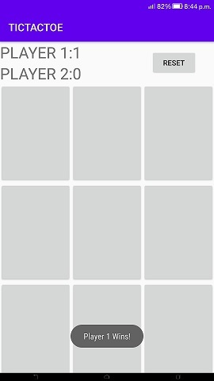

# Tic-Tac-Toe
Tic-tac-toe is a two player game. The two players take turns putting marks on a 3x3 board. The player who first gets 3 of his/her marks in a row (vertically, horizontally, or diagonally) wins the game, and the other loses the game.
The code has the whole game logic, count player points, add a reset functionality and handle orientation changes, so we don’t lose our game state when we rotate the device.

LANGUAGE - JAVA

IDE - ANDROID STUDIO

{:class="img-responsive"}
{:height="50%" width="50%"}
{:height="700px" width="400px"}
